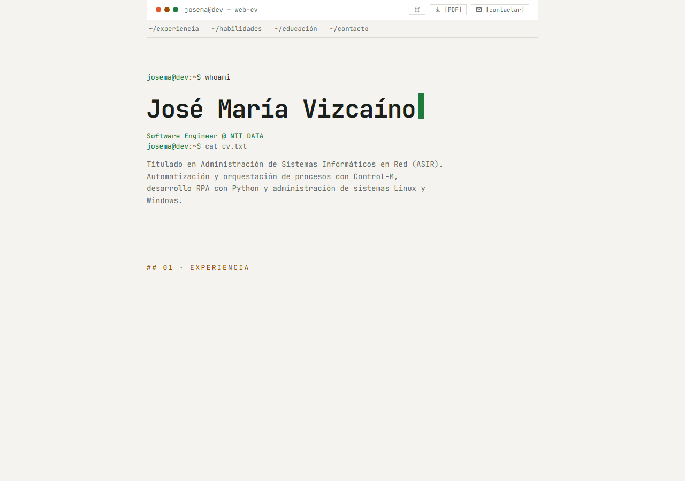
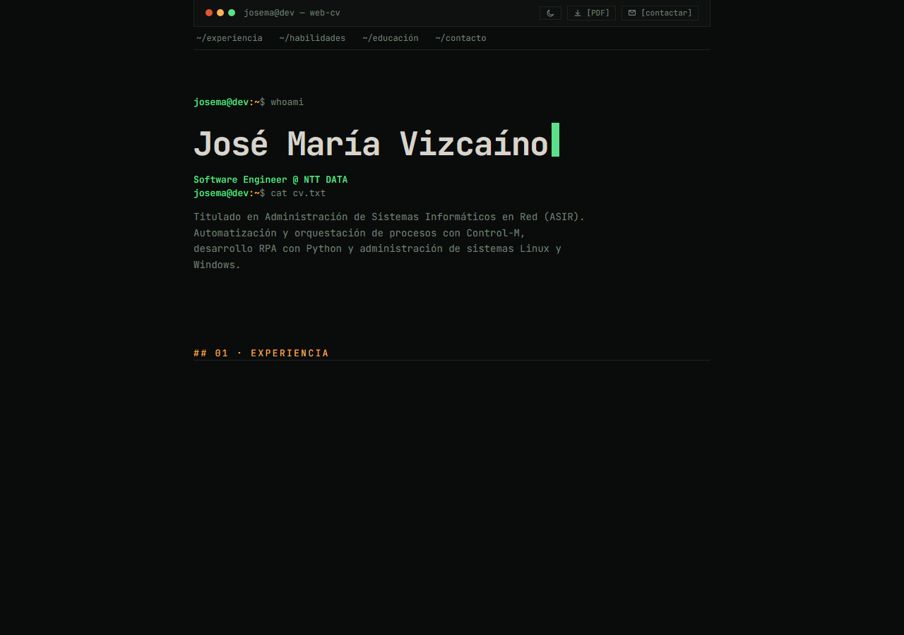

# Web CV — José María Vizcaíno

CV one-page de José María Vizcaíno (Software Engineer) — **público en
[https://joviur.dpdns.org/cv/](https://joviur.dpdns.org/cv/)**.

Construida con **Astro 5 + TypeScript + Tailwind CSS v4** e interactividad en
**JS vanilla** (~2.2 KB gzip, cero frameworks).

| Tema claro | Tema oscuro |
|---|---|
|  |  |

## ✨ Características

- **Estética Registry/Manpage** (light-first, JetBrains Mono) — terminal simulada:
  prompts `josema@dev:~$`, barra TUI con semáforos, navegación `~/seccion`
- **Boot animado del hero**: `$ whoami` y `$ cat cv.txt` se teclean al cargar;
  el resto de la página aparece al terminar (fade de 0.5 s)
- **Contacto por modal TUI** (`[contactar]` en navbar y footer): formulario con
  nombre, empresa, mail, asunto (opcional) y mensaje. El email y el teléfono
  **no se publican** — el mensaje llega al dueño vía endpoint propio + Resend
- Scroll-spy (sección activa en la navbar), filtros de habilidades, tema
  dark/light persistente (light por defecto), botón **PDF** con vista de
  impresión limpia
- **Progressive enhancement**: sin JS el contenido es visible y el formulario
  funciona con submit nativo (patrón `html.js` en todo el sitio)
- Accesible: `prefers-reduced-motion`, `aria-pressed`/`aria-live`, diálogo con
  focus trap, jerarquía de headings, contraste AA
- i18n preparado (helper `t()` con fallback a español; traducción EN pendiente)

## 🏗️ Arquitectura del proyecto

```
                        ┌───────────────────────────────┐
                        │           src/ (Astro 5)      │
                        │                               │
   ┌──────────────┐     │  pages/index.astro           │
   │ data/cv.ts   │────►│   ├─ Navbar (CTA, tema, PDF) │
   │ (contenido)  │     │   ├─ Hero (boot de tipeo)    │
   └──────────────┘     │   ├─ Experience / Skills     │
   ┌──────────────┐     │   │  Education / Projects    │
   │ i18n/        │─t()►│   └─ Footer + ContactModal   │
   │ translations │     │      lib/ · styles/ · types/ │
   └──────────────┘     └──────────────┬────────────────┘
                                       │  pnpm build (ASTRO_BASE=/cv)
                                       ▼
                                 dist/ (estáticos)
                                       │
                                 deploy.sh ──► VPS (ver DEPLOY.md)
```

## ☁️ Arquitectura de infraestructura

```
 Visitante ──► https://joviur.dpdns.org/cv/
                    │
            Cloudflare (TLS, DNS)
                    │  túnel saliente (cloudflared) — sin puertos abiertos
                    ▼
      ┌────────────── VPS OVH (UFW cerrado) ──────────────────────────┐
      │                                                               │
      │   cloudflared (contenedor)                                    │
      │       │                                                       │
      │       ▼                                                       │
      │   Caddy :8080 (contenedor web-cv · red webcv-net)             │
      │    ├─ /cv/*      → dist/ (estáticos, bind mount ro)           │
      │    └─ /cv/api/*  → contacto-api :8081 (contenedor Node)       │
      │                        │                                      │
      │                        ▼                                      │
      │                  Resend API (SMTP)                            │
      └────────────────────────┼──────────────────────────────────────┘
                               ▼
                  📧 [email-eliminado]
```

Detalles de operación y despliegue en **[DEPLOY.md](DEPLOY.md)**; decisiones de
seguridad en **[SECURITY.md](SECURITY.md)**; patrones del frontend en
**[ARCHITECTURE.md](ARCHITECTURE.md)**.

## ⚡ Rendimiento (build de producción, medido)

| Recurso | Tamaño | gzip |
|---|---|---|
| HTML (todo el contenido del CV) | 25.1 KB | 5.9 KB |
| CSS | 24.2 KB | 5.8 KB |
| JS (3 módulos: modal, skills, i18n) | 4.3 KB | **2.2 KB** |

El texto del CV está en el HTML desde el primer byte (FCP sin depender de JS).
Presupuesto JS total < 10 KB gzip (controlado en cada feature).

## 🚀 Desarrollo

```bash
pnpm install        # dependencias (pnpm, nunca npm)
pnpm dev            # dev server en la raíz (sin base /cv)
pnpm test           # lógica pura (Vitest, entorno node)
pnpm lint           # oxlint
pnpm build          # build de producción (sin base → raíz)
ASTRO_BASE=/cv pnpm build   # build como se despliega (base /cv)
pnpm preview        # servir dist/ localmente
```

## 📝 Actualizar el CV

**Un solo archivo:** `src/data/cv.ts` — nombre, título, ubicación, resumen,
experiencia, habilidades, educación y proyectos. La UI se adapta sola.

> 🔒 **Privacidad:** el email y el teléfono **no viven en el repo**. El destino
> real del correo está solo en el VPS (`~/web-cv-secrets/contacto.env`, 600).
> No los añadas a `cv.ts` ni a ningún fichero del frontend.

- Añadir un proyecto → la sección "Proyectos" aparece automáticamente.
- Traducción EN → rellenar `translations.en` y mostrar el botón de idioma.

## 🖥️ Desplegar

```bash
./deploy.sh         # build (base /cv) + sube dist/ + reinicia Caddy
```

Guía completa (despliegue inicial, operación, troubleshooting): **DEPLOY.md**.

## 🗂️ Estructura del repo

```
├── src/                     # frontend Astro
│   ├── pages/index.astro    # página única: head SEO + layout + reveal
│   ├── components/          # Navbar, Hero, secciones, Footer, ContactModal
│   ├── data/cv.ts           # ⭐ contenido del CV (única fuente de verdad)
│   ├── i18n/translations.ts # diccionarios es/en + helper t()
│   ├── lib/                 # lógica pura testeable (typing, skills)
│   └── styles/global.css    # Tailwind v4: tokens, dark, print, modal
├── server/contacto/         # endpoint del formulario (Node 22, 0 deps) + Containerfile
├── deploy/                  # Caddyfile, Containerfile cloudflared, quadlets
├── scripts/serve-cv-test.mjs# verificación local del sitio bajo /cv
├── docs/                    # capturas del sitio
├── deploy.sh                # build + despliegue del contenido web
└── SPEC-*.md · PLAN-*.md    # decisiones de diseño por feature (ver abajo)
```

## 📚 Documentación del proyecto

| Documento | Contenido |
|---|---|
| [DEPLOY.md](DEPLOY.md) | Arquitectura de infra, despliegue inicial, operación, troubleshooting |
| [SECURITY.md](SECURITY.md) | Privacidad, anti-spam, política de secrets, hardening |
| [ARCHITECTURE.md](ARCHITECTURE.md) | Patrones del frontend, flujo de contacto, presupuesto JS |
| SPEC-contacto.md | Modal de contacto + endpoint (decisiones D1–D14) |
| SPEC-hero-typing.md · SPEC-hero-resto.md | Animación del hero y revelado del resto |
| PLAN-deploy.md | Histórico de la fase de despliegue (Cloudflare Tunnel) |
| PROGRESS.md | Estado por fases + historial con verificación de cada una |

## 🧩 Proceso de desarrollo

Cada feature sigue **Spec-Driven Design**: SPEC con decisiones cerradas →
codificación (opencode CLI) → verificación en navegador → commit por fase →
actualización de `PROGRESS.md`.
